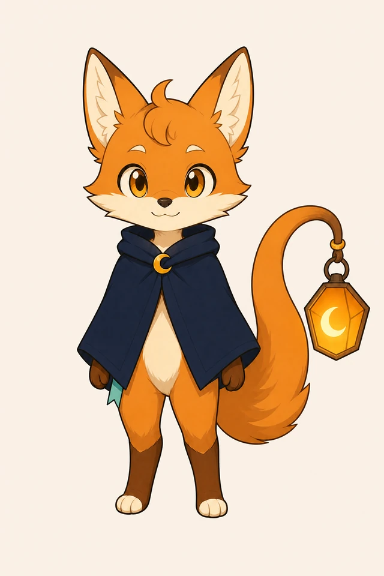
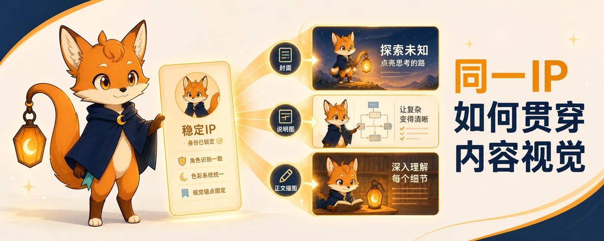
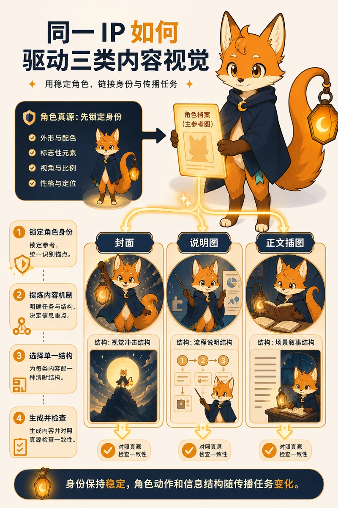
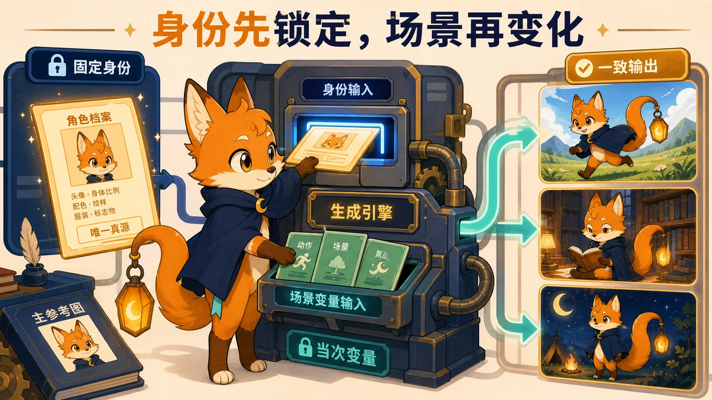

# IP Studio

`ip-studio` 是一个可由 Codex 或兼容 AI Agent 加载的角色生产 Skill。你可以交给它零散的身份线索、一张已经认可的角色图，或一个已锁定的角色包；它会把这些材料整理成稳定角色，并继续制作传播视觉或 Codex v2 桌宠。

它负责补全结构、生图、看图检查、重试、版本管理和文件校验。你只需要决定会改变角色身份、内容重点或既有安装的事项。

## 你会得到什么

- **建立或修改角色**：得到完整角色档案、角色说明、单张正式主参考图和可回读的历史版本。
- **制作衍生视觉**：得到头像、主页横幅、资料卡、文章封面、说明图或正文插图，以及对应的内容简报、生成输入和校验记录。
- **制作 Codex 桌宠**：得到包含九组应用状态、十六个注视方向和 QA 证据的 Codex v2 宠物目录，并可在确认后安装到本机 Codex。

角色包是后两条工作流的共同输入。只有一张已认可图片时，IP Studio 会先把它导入并锁定为角色包；还没有角色时，它会先完成角色设计，再回到你原本要做的视觉或桌宠任务。

**直接开始：** [安装 Skill，并选择一条可直接复制的请求](#安装与第一次使用)。

## 效果展示

下面用仓库内的“灯灯”示例展示 IP Studio 的三类交付：稳定的角色身份、持续复用的内容视觉，以及 Codex v2 桌宠。角色的双耳、额毛、墨蓝斗篷、月牙扣、狐尾与独立悬挂灯笼保持一致，动作、场景和信息结构随任务变化。

<p align="center">
  
</p>
<p align="center"><sub>主页横幅：角色亲自用灯笼把复杂问题照亮。</sub></p>

<p align="center">
  
</p>
<p align="center"><sub>正式主参考图：后续视觉共同读取的单张默认角色参考。</sub></p>

<p align="center">
  
</p>
<p align="center"><sub>文章封面：同一角色继续承担内容传播任务。</sub></p>

<p align="center">
  
</p>
<p align="center"><sub>说明图：角色直接参与信息流程，而不是站在内容旁边充当装饰。</sub></p>

<p align="center">
  
</p>
<p align="center"><sub>正文插图：固定角色身份，把动作、场景和氛围留给当前任务决定。</sub></p>

<p align="center">
  <br>
  <sub>Codex v2 桌宠：九组应用状态、十六个注视方向和透明边缘检查。</sub>
</p>

## 安装与第一次使用

将仓库克隆到 Codex 的个人 Skills 目录：

```powershell
git clone https://github.com/CheshireMew/ip-studio.git "$env:USERPROFILE\.codex\skills\ip-studio"
```

重新打开 Codex 后，直接描述你要得到的结果。你不需要运行仓库脚本、编辑 JSON、手动编号或整理生成文件。

### 从零建立角色

```text
$ip-studio 从零为我设计并定稿一个可以长期使用的个人 IP 角色。
```

IP Studio 会先给出三条真正不同的角色方向，完成主参考图和一致性检查，再把获批结果写入当前可写工作区的 `ip-studio-output/<角色标识>/`。角色包锁定后即停止；只有你同时点名其它结果时，才继续制作视觉或桌宠。

### 导入或修改已有角色

```text
$ip-studio 把这张已经确认的角色图导入为可长期复用的角色包。
```

```text
$ip-studio 读取 E:\path\to\character-kit，把斗篷改成墨蓝色；其它固定特征保持不变并生成新版本。
```

导入时请附上图片，修改时请给出角色包路径。改变固定身份会建立新版本，旧版本和旧主参考图会保留。

### 制作头像、主页视觉或文章配图

```text
$ip-studio 使用 E:\path\to\character-kit，为这篇文章制作一张 5:2 封面。文章内容如下：……
```

请提供角色包路径、要制作的结果，以及正文、品牌资料或其它内容真源。正式图片会归档到角色包的 `derivatives/<类型>/<视觉标识>/`；归档记录可以重新核对角色版本、内容简报、生成输入、参考资料和最终图片。衍生视觉不会反向修改角色身份，也不会自动扩展成未点名的比例或媒体。

IP Studio 会在同一条流程里完成内容提炼、视觉构思、角色融合、提示词、生图、看图检查和归档。仓库当前内置“极简手绘 IP”和“OKX Editorial”两套内容视觉语言。例如：

```text
$ip-studio 使用 E:\path\to\character-kit，根据下面的定稿做一张 1:1 OKX 风格社交配图，把我的 IP 角色融入画面：……
```

这类请求直接读取内置 `style-profile.json`，把黑白高对比、霓虹黄绿色、标题层级、构图、材质和角色融合规则编译进提示词。七张来源案例不会在日常生成时打开或传给生图模型；图片输入默认只有角色主图和当前任务素材。用户明确要求精确 OKX Logo 时，才加入已保存的透明品牌标记。

### 制作并安装 Codex 桌宠

```text
$ip-studio 把 E:\path\to\character-kit 制作并安装为可用的 Codex v2 桌宠。
```

桌宠路径会生成九组状态动画、十六个注视方向、动态预览、盲审和透明边缘检查，再输出只包含 `pet.json` 与 `spritesheet.webp` 的正式宠物目录。安装成功后，你只需要重新打开 Codex，并在设置中启用宠物；如果同一宠物标识已被不同内容占用，IP Studio 会先保存旧安装并请你确认是否替换。

制作桌宠时，工作区 Python 环境需要提供 Pillow 和 NumPy。角色档案和普通衍生视觉脚本只使用 Python 标准库。

## 角色一致性怎样保持

`character-profile.json` 保存角色可以被重建的结构，档案中登记的单张主参考图提供默认视觉依据。它们共同构成角色身份边界：

1. 角色创建或修改先更新身份，再通过另一姿势和场景检查可复用性。
2. 衍生视觉和桌宠只读取当前角色档案与主参考图，并保存当次快照。
3. 当次动作、构图、场景和氛围不会反向写回角色身份。
4. 正式结果保留版本、输入、校验值和历史，后续任务可以重新读取和验证。

## 能力边界

IP Studio 当前支持风格化人形、动物、拟人、物件和幻想生物，以及与同一角色相连的社交主页视觉、文章视觉和 Codex v2 桌宠。

照片级数字分身、普通个人品牌策略、没有 IP 角色参与的一般视觉、Live2D、视频、通用动画、Windows 独立桌宠和非 Codex 桌宠平台不属于当前能力范围。安装、上传、发送和发布也不会因为生成完成而自动发生；只有“制作可用的 Codex 桌宠”包含本机 Codex 宠物安装。

## 维护者入口

```text
ip-studio/
├─ .project-steward/project.json
├─ SKILL.md
├─ agents/openai.yaml
├─ references/
│  ├─ character-system.md
│  ├─ visual-production.md
│  └─ pet-production.md
├─ assets/visual-languages/
│  ├─ minimal-handdrawn/
│  └─ okx-editorial/
└─ scripts/
   ├─ character_kit.py
   ├─ visual_kit.py
   ├─ pet_kit.py
   └─ pet/
```

`SKILL.md` 是工作流、权限边界和交付标准的正式入口；三个顶层脚本分别负责角色包、衍生视觉和桌宠的机器可验证合同。修改工作流后，先检查三套命令入口仍可读取：

```powershell
python scripts/character_kit.py --help
python scripts/visual_kit.py --help
python scripts/pet_kit.py --help
```

角色和衍生视觉的最终验收必须读取脚本正式输出并实际看图；桌宠还需要验证完整 8×11 精灵表、九组动画预览、十六方向语义、盲审和安装目录。只运行帮助命令或静态检查不能代替这条真实链路。

## 隐私

Skill 默认只读取当前请求、当前对话、用户明确提供的材料，以及用户明确指向的角色文件夹。生成的角色包、图片、QA 文件和桌宠运行记录保存在本地输出目录，不属于本仓库，也不会被默认提交。

公开问题或贡献代码前，请确认提交中不包含角色私有素材、文章草稿、品牌资料、绝对路径、访问令牌或生成记录。

## 许可

本项目采用 [Apache License 2.0](LICENSE)。
